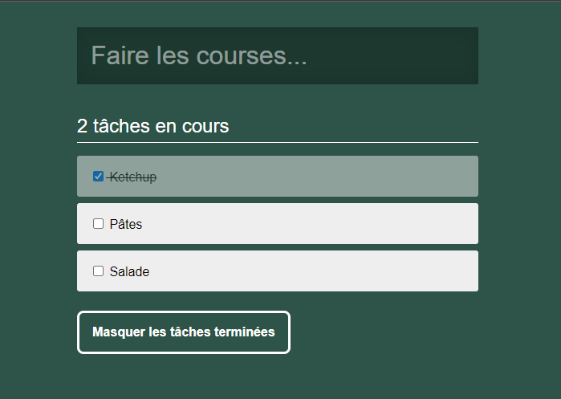

# Todolist en React

Créons une todolist avec React :smiley:



## Objectifs

Mise en place

- Un dossier `/inte` contient un exemple de structure html et de css correspondant au résultat ci-dessus
- On va reproduire la même structure mais en javascript à l'aide de React pour pouvoir ensuite intéragir facilement

Pour cela

- Initialiser un projet avec Parcel
- Faire le rendu avec ReactDOM
- Gérer la structure et les styles en s'inspirant de la structure fournie
- Découper puis créer les composants avec React en modularisant au maximum
- Placer les props
- Dynamiser l'affichage avec des données provenant du fichier `tasks.js`

Fonctionnalités attendues :

1. Rendre actif un bouton pour afficher ou masquer les tâches terminées à l'aide d'un `state`
2. Permettre l'ajout d'une tâche

- Utiliser le hook d'état pour définir le state dans le composant racine
- Stocker les tâches de `tasks.js` dans le `state`
- Calculer le compteur de tâches non-effectuées à partir des données du `state` ... et s'en servir
- Dynamiser tout l'affichage de la liste des tâches avec les données du `state`
- Ajouter une nouvelle tâche à la validation du formulaire

## BONUS

- Gérer le cas : cocher une tâche
- Ordonner les tâches
  - En haut, les tâches non effectuées
  - Ensuite, les tâches effectuées

  # Etapes pour mettre en place la todolist

## Etape 1

Installer le projet (npm install parcel, react, react-dom)

## Etape 2 - Liste statique

Créer les composants pour segmenter l'application React

- Composant App (racine)
- Composant Form (ajouter une nouvelle tâche)
- Composant Tasks (liste des tâches)
- Composant Task (une tâche)

Tester l'App et utiliser le Component React Dev Tools pour vérifier que c'est ok

## Etape 3 - Liste dynamique

### 3.1 - Création des props

- Composant Task : je veux ajouter les props pour personnaliser son contenu

- Dans le composant <Tasks>, tester le passage des props

```jsx
return (
    <>
        <Task id="1" title="faire les courses" >
        <Task id="2" title="remplir le frigo" >
    </>
)
```

Tester que ça fonctionne !

### 3.2 - Dynamisation via des data

- Créer le fichier data/index.js avec l'export des données (tableau d'objets)
- je reprends le composant Tasks et j'importe les data dans le composant
- je rajoute la fonction map() pour dynamiser les données

```jsx
return (
    <>
        {
            tasks.map((task) => (
                <Task key={...} ... />
            ))
        }
    </>
)
```

Tester que la page s'affiche bien.

## Etape 4 - Rajout du state

- Identifier où est-ce que je dois placer les data dans l'App React, de telle façon à me permettre d'en rajouter (une nouvelle création) ?

Si j'ai besoin de rajouter une nouvelle tâche dans le state, l'idéal, est de le placer dans le composant App.

- 1- je fais l'import dans le composant App des data
- 2- je défini le state dans App (useState())
- 3- je passe le state du composant App vers le composant Tasks (passage de props)
        - je défini la props tasks dans Tasks
        - je modifie le composant Tasks pour supprimer l'import et le remplacer par la props
                    data.map() => tasks.map()
- 4- je modifie le composant App et je passe la valeur du state à la props

```jsx
return (
    <>
        <Form />
        <Tasks tasks={tasks} />
    </>
)
```

Tester pour vérifier que ça fonctionne

### Etape 5 - Dynamisation et gestion du formulaire

## Au niveau du composant Form

- Au niveau du formulaire, il faut :
  - 1- rajouter les useState() pour les champs du formulaire ([title, setTitle] = useState(""))
  - 2- Sur les champs du formulaire
    - value={title}
    - onChange={(e) => setTitle(e.current.value)}
  - 3- Gérer le onSubmit sur le form, idéalement il faut créer une fonction

```jsx
const handleSubmit = (e) => {
    e.preventDefault();

    // Action ?
    // Ajouter une tâche dans la liste des tâches
    // ==> Dans le composant <App /> => dans le state 
}

return (
    <form onSubmit={(e) => handleSubmit(e)}>
        ...
    </form>
)
```

## Au niveau du composant App

- je créer une fonction qui va me permettre de rajouter un nouvel élément dans le state.

```jsx

// [ {id: '1', title: 'faire les courses'}, {id: '2', title: 'Deuxième tâche'}]
const [tasks, setTasks] = useState(data)

// Paramètre : pour créer une nouvelle tâche, j'ai besoin de quoi ?
// > 
const addNewTask = (idNewTask, titleNewTask) => {
    
    // Comment je fais pour rajouter une nouvelle tâche
    const newTasks = [...tasks];
    //tasks.map((task) => { newTasks.push(task) })

    // je crée la nouvelle tâche
    const newTask = {
        id: idNewTask,
        title: titleNewTask
    }

    newTasks.push(newTask)
    setTasks(newTasks)
}

```

### Câblage des infos

- d'un côté, dans le composant <Form>, j'ai une fonction handleSubmit() qui m'a permis de soumettre le formulaire
- dans le composant <App>, j'ai une fonction addNewTask() qui m'a permis de rajouter une nouvelle tâche dans le state

Conclusion

- Comment est-ce que depuis le form, je vais mettre à jour le state ?

<App> est le composant parent de <Form> => je peux passer la fonction de App vers Form

Dans App

```jsx

return (
    <Form addNewTask={addNewTask} >
)

```

Dans le Form

```jsx

const handleSubmit = (e) => {
    e.preventDefault();

    // Action ?
    addNewTask(4, title)
}

```
# Todolist
